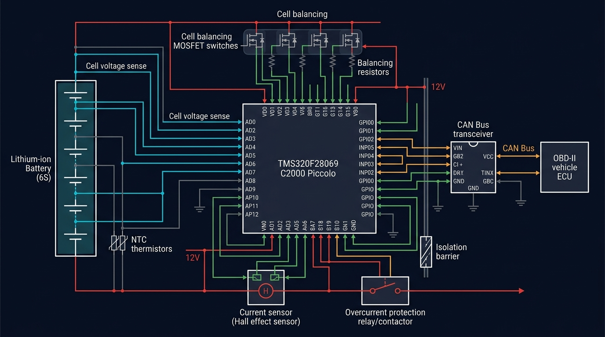
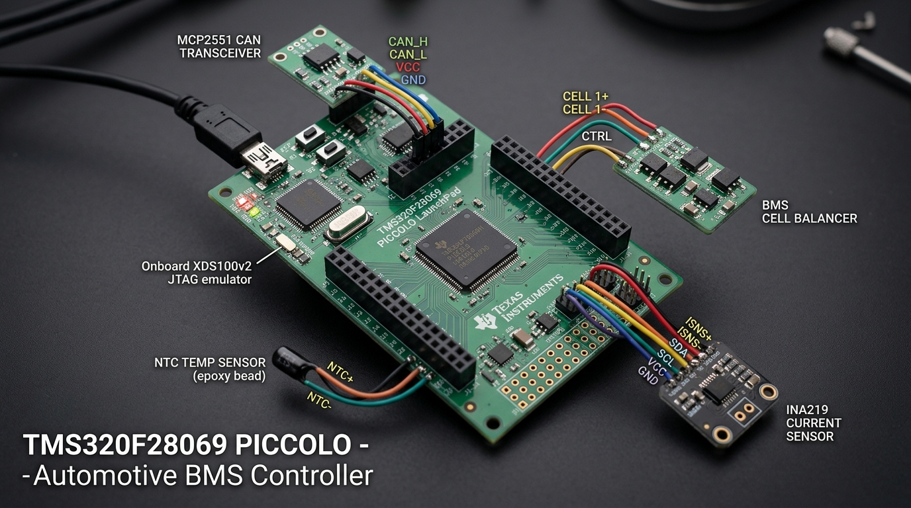
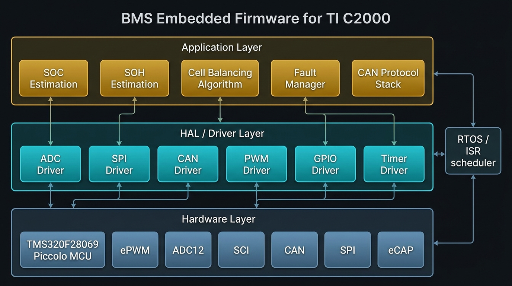
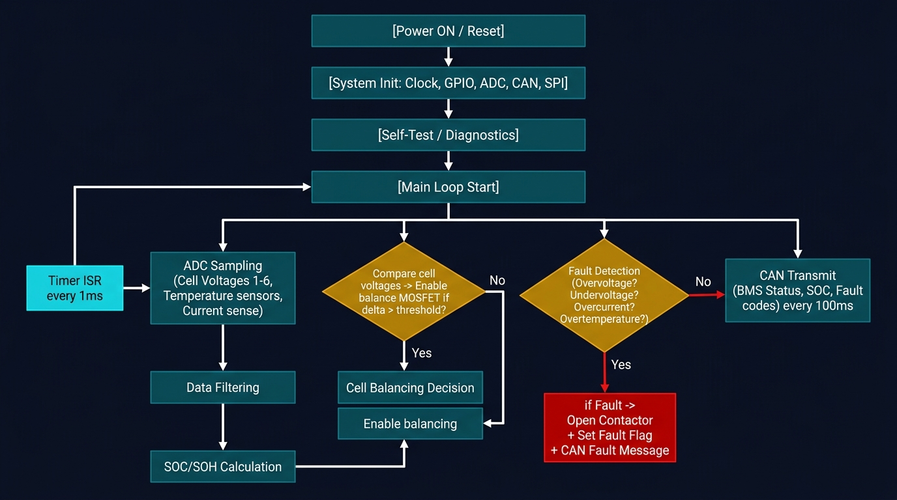
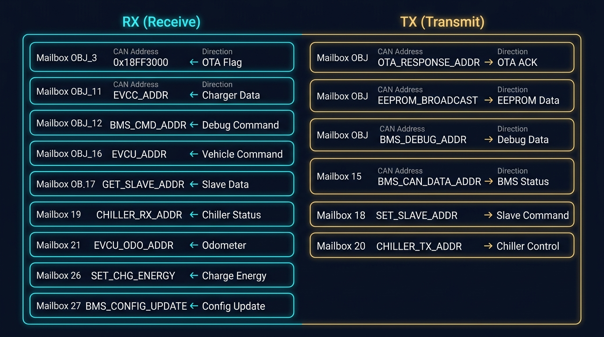
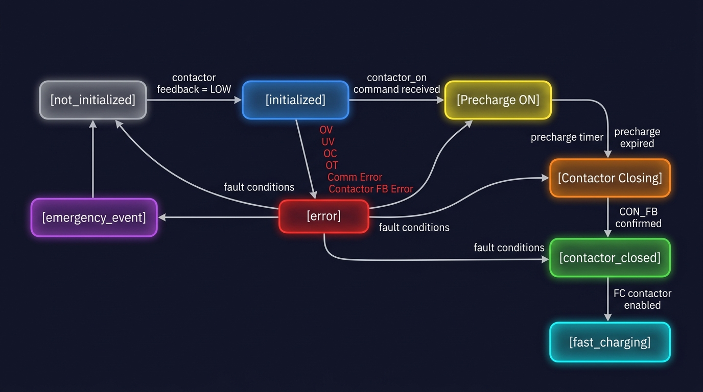

<div align="center">

# 🔋 C2000 Piccolo — Automotive Battery Management System Firmware

### `BMS_Central_Control.c`

[](https://www.ti.com/product/TMS320F28069)
[-orange?style=for-the-badge)](https://www.ti.com/tool/C2000WARE)
[](.)
[](.)
[](.)

> **Production-grade Battery Management System firmware for electric vehicle applications.**
> Running on TI TMS320F28069 Piccolo — managing cell monitoring, SOC/SOH estimation,
> CAN communication, thermal management, OTA firmware updates, and HV safety protection.

</div>

---

## 📋 Table of Contents

1. [Hardware Overview](#1-hardware-overview)
2. [Software Architecture](#2-software-architecture)
3. [Project File Structure](#3-project-file-structure)
4. [Firmware Execution Flow](#4-firmware-execution-flow)
5. [System Initialization](#5-system-initialization)
6. [Core Peripherals](#6-core-peripherals)
7. [Battery Data Acquisition](#7-battery-data-acquisition)
8. [SPI Communication Protocol](#8-spi-communication-protocol)
9. [CAN Bus Architecture](#9-can-bus-architecture)
10. [Contactor State Machine](#10-contactor-state-machine)
11. [SOC / SOH Estimation](#11-soc--soh-estimation)
12. [Thermal Management](#12-thermal-management)
13. [Fault Protection](#13-fault-protection--trip-events)
14. [OTA Firmware Update](#14-ota-firmware-update)
15. [Timer & ISR Architecture](#15-timer--isr-architecture)
16. [Key Data Structures](#16-key-data-structures)
17. [Compile-Time Flags](#17-compile-time-configuration-flags)
18. [Function Reference](#18-function-reference)
19. [Build & Flash Instructions](#19-build--flash-instructions)
20. [Supported Platforms](#20-supported-vehicle-platforms)

---

## 1. Hardware Overview

The firmware runs on the **TMS320F28069 C2000 Piccolo** — a 90 MHz real-time MCU from Texas Instruments.



*Hardware block diagram: ADC sense lines (cyan), CAN bus (amber), power rails (red), GPIO control (green)*

### MCU Specifications

| Parameter | Value |
|-----------|-------|
| **MCU** | TMS320F28069 Piccolo |
| **CPU Clock** | 90 MHz |
| **Flash** | 256 KB |
| **SRAM** | 100 KB |
| **ADC** | 12-bit, up to 16 channels |
| **CAN** | eCAN-A (32 mailboxes) |
| **SPI** | SPI-A Master, 4 MHz |
| **UART/SCI** | SCI-A 115200 baud, SCI-B 9600 baud |
| **I2C** | I2C-A (RTC + External ADC) |
| **Timers** | CPU Timer 0 (50 ms), CPU Timer 1 (100 ms) |
| **PWM** | ePWM2 (Coolant pump) |

### Development Setup



*LAUNCHXL-F28069M development board wired to BMS peripherals for testing and validation*

---

## 2. Software Architecture

The firmware is organized in **3 layers**: Application Logic, HAL/Drivers, and Hardware Peripherals — driven by CPU timer ISRs.



### Layer Breakdown

```
+─────────────────────────────────────────────────────────────────+
|                    APPLICATION LAYER                            |
|  SOC/SOH Estimation | Cell Balancing | Fault Manager | CAN Mgr |
+─────────────────────────────────────────────────────────────────+
|                    DRIVER / HAL LAYER                           |
|   ADC Driver | SPI-A Driver | eCAN Driver | I2C Driver          |
|   SCI/UART   | GPIO Driver  | Timer Driver| Flash API           |
+─────────────────────────────────────────────────────────────────+
|                    HARDWARE LAYER (F28069)                      |
|  ePWM | ADC12 | SCI-A/B | eCAN-A | SPI-A | I2C-A | eCAP       |
+─────────────────────────────────────────────────────────────────+
         ^ Timer ISRs (50 ms / 100 ms) drive the execution engine
```

---

## 3. Project File Structure

```
BMS_Firmware/
|
+-- BMS_Central_Control.c     <- MAIN FILE (documented here)
|       +-- main()                System entry point & super-loop
|       +-- SYS_CONFIG()          System & peripheral init
|       +-- C2000_config()        PIE / interrupt vector config
|       +-- ECAN_CONFIG()         CAN mailbox configuration
|       +-- I2CA_Init()           I2C bus initialization
|       +-- C2000_SCI_int()       UART/RS-485 config
|       +-- C2000_SPI_MSP()       SPI master config
|       +-- hv_batterry_read()    Main battery data polling loop
|       +-- main_msp_config_loop()MSP430 SPI config handshake
|       +-- seperateBMSdata()     SPI packet parser
|       +-- analyze_rdata()       Min/max cell V & T computation
|       +-- contactor_operator()  Contactor FSM (normal mode)
|       +-- contactor_operator_fire() Contactor FSM (fire mode)
|       +-- BMS_can_data()        CAN TX frame preparation
|       +-- timer_task_can()      Periodic 100 ms CAN transmit
|       +-- chillerCtrl()         Thermal management logic
|       +-- slave_controller()    Parallel pack slave management
|       +-- master_dataSort()     Multi-pack SOC aggregation
|       +-- update_BMS()          OTA ISR entry handler
|       +-- move_to_kernal()      OTA Flash write + MCU reset
|       +-- resetBMS()            Watchdog-triggered reset
|
+-- main_data.h               <- CONTROLLER_DATA, BMS_DATA structs
+-- PDU_matrix.h              <- CAN PDU frame definitions
+-- config_ctrl.h             <- Safety thresholds & config defines
+-- CLAShared.h               <- CLA shared memory (FIR filter data)
+-- mcp_can.h                 <- CAN driver interface
+-- soc_soh.h                 <- SOC/SOH algorithm declarations
+-- BMS_controller_CAN.h      <- BMS CAN message encoding/decoding
+-- RS485_shunt.h             <- RS-485 shunt current sensor driver
+-- BMS_I2C.h                 <- I2C RTC & ADC helper functions
+-- chiller.h                 <- Chiller controller interface
+-- eprom_config.h            <- EEPROM parameter persistence
+-- Pump_PWM.h                <- ePWM2 coolant pump driver
+-- Flash2806x_API_Library.h  <- TI Flash programming API
```

---

## 4. Firmware Execution Flow



### Main Loop Sequence

```
main()
 |
 +-- memset()  ->  Zero all BMS data structures
 +-- memcpy()  ->  Copy .ramfuncs to SARAM (ISR speed)
 |
 +-- [OTA Boot Check] -> read_flag(FLASH_FLAG)
 |    +-- BOOT_CONFIG + JUMP_FLAG > 1 -> clear_jump_flag()
 |    +-- BOOT_CONFIG + JUMP_FLAG <=1 -> move_to_kernal(BACKUP)
 |
 +-- SYS_CONFIG()    -> Init all hardware peripherals
 +-- CONFIG_Gpio()   -> GPIO pin directions
 +-- ADC_CONFIG()    -> ADC SOC trigger setup
 +-- soc_init()      -> Load last SOC from EEPROM
 |
 +-- for(;;)  [INFINITE SUPER LOOP]
      |
      +-- EEPROM save pending?  -> save_parameter_to_eeprom()
      |
      +-- hv_reset_set?         -> main_msp_config_loop()
      |                                (SPI config handshake)
      |
      +-- timer_flag_can > 0?   -> timer_task_can()
      |                                (CAN TX every 100 ms)
      |
      +-- hv_batterry_read()    -> SPI poll -> parse cell data
      |
      +-- BMS_can_data()        -> Pack CAN TX frames
      |
      +-- I2C bus free?         -> time_rtc() / adc_read_asd()
      |
      +-- soc_soh_flag?         -> calc_soc_soh()
                                    charge_ctrl()
                                    chillerCtrl()
```

---

## 5. System Initialization

`SYS_CONFIG()` brings up all hardware in the correct dependency order:

```c
void SYS_CONFIG() {
    InitFlash();          // Flash wait-states for 90 MHz
    InitSysCtrl();        // PLL -> 90 MHz system clock
    DINT;                 // Disable interrupts during config
    InitPieCtrl();        // Clear PIE vector table
    IER = IFR = 0x0000;  // Clear all interrupt flags
    InitPieVectTable();   // Load default PIE vectors
    InitCpuTimers();      // Timer 0 (50ms) + Timer 1 (100ms)
    InitAdc();            // 12-bit ADC calibration
    InitSciaGpio();       // SCI-A GPIO (RS-485, 115200 baud)
    InitScibGpio();       // SCI-B GPIO (9600 baud debug)
    InitSpiaGpio();       // SPI-A GPIO (MSP430 interface)
    InitEPwm2Gpio();      // ePWM2 (coolant pump PWM)
    InitI2CGpio();        // I2C-A (RTC + external ADC)
    CAN_Init();           // eCAN-A GPIO & bit timing
    I2CA_Init();          // I2C clock & mode config
    C2000_config();       // PIE enable + ISR vector binding
    C2000_SCI_int();      // SCI-A/B FIFO & baud rates
    C2000_SPI_MSP();      // SPI-A master, CPOL=1, 4 MHz
    EINT; ERTM;           // Enable global interrupts
}
```

---

## 6. Core Peripherals

### SPI-A — MSP430 Interface

| Setting | Value |
|---------|-------|
| Mode | Master |
| Clock | 4 MHz (SPIBRR = 6) |
| Clock Polarity | Active Low (CPOL = 1) |
| Word Length | 8-bit (sent as 16-bit register) |
| Protocol | Custom framed: 0xAA 0x0B...payload...0xAA 0x0E |

### SCI Ports — RS-485 / Debug

| Port | Baud | Direction | Purpose |
|------|------|-----------|---------|
| SCI-A | 115,200 | RX FIFO (4) | RS-485 shunt sensor / debug |
| SCI-B | 9,600 | TX only | Secondary debug output |

### I2C-A — RTC & External ADC

| Parameter | Value |
|-----------|-------|
| Module Clock | 7-12 MHz (prescaler = 8) |
| CLK Low / High | 20 / 10 cycles |
| Connected Devices | DS3231 RTC, ADS1115 ADC |

### ePWM2 — Coolant Pump

Drives the coolant pump at variable duty cycle. Default on chiller activation: **60%**.

---

## 7. Battery Data Acquisition

`hv_batterry_read()` polls MSP430 slave MCUs (which drive LTC681x cell ICs) over SPI-A.

### Request Rotation Sequence

```
request_packet_type
        |
        +-- ALL_DATA        -> Request_all_data()     (per IC)
        +-- CLASSIFIED      -> Request_classified()   (summary)
        +-- HUMIDITY_TEMP   -> Request_humidity()     (SHT30)
        +-- OPEN_WIRE       -> Request_openWire()     (wire test)
                |
                v
        SPI_packet_receive()  (state-machine frame receiver)
        crc_1021(len, buf)    (CRC-16 integrity check)
                |
         CRC == 0?  --NO--> Resend_request_flag = 1
                |
               YES
                v
        seperateBMSdata()    (parse into BMS_data_IC[])
        analyze_rdata()      (min/max/avg after ALL_DATA cycle)
```

### Data Extracted Per IC

| Field | Description |
|-------|-------------|
| `cell_voltages[CELLS_PER_IC]` | Individual cell voltages |
| `aux_voltages[AUX_PER_IC]` | GPIO/NTC auxiliary voltages |
| `Pack_voltage` | IC sub-pack total voltage |
| `I_temp` | LTC die temperature (deg C) |
| `V_regA / V_regD` | Analog / digital supply voltages |
| `UV_OV_flags` | Per-cell over/undervoltage bits |
| `mux_fail / THSD` | Mux and thermal self-test bits |
| `temparature_val[TEMP_PER_IC]` | NTC thermistor temperatures |
| `d_cell.all` | Active cell balancing bitmap |
| `humi_msb/lsb` | SHT30 raw humidity bytes |
| `open_wire_lsb/msb` | Open-wire detection result |

---

## 8. SPI Communication Protocol

Custom framed binary protocol with byte-stuffing between C2000 (master) and MSP430 (slave).

### Frame Structure

```
+------+------+---------------------------+----------+------+------+
| 0xAA | 0x0B |      PAYLOAD BYTES        | CRC-1021 | 0xAA | 0x0E |
| SOF1 | SOF2 |      (byte-stuffed)       | (2 bytes)| EOF1 | EOF2 |
+------+------+---------------------------+----------+------+------+
```

### Byte Stuffing Rules

| Original Byte | Escaped Sequence |
|---------------|-----------------|
| `0xAA` | `0x23` `0xAA` |
| `0x23` | `0x23` `0x23` |

### CRC-16/CCITT Verification

Polynomial: `0x1021`, Initial value: `0xFFFF`

```c
// Valid packet: residue equals zero
CRC_val_c = crc_1021(SPI_rec_packed_length, received_data_buffer);
if (CRC_val_c == 0) { /* Valid -- process data */   }
else                 { Resend_request_flag = 1;      }
```

### Packet Type Codes

| Code | Name | Dir | Description |
|------|------|-----|-------------|
| `ALL_DATA` | Full request | C2000->MSP | All cell V/T/status |
| `CLASSIFIED` | Summary | C2000->MSP | Min/max summary |
| `HUMIDITY_TEMPERATURE` | SHT30 | C2000->MSP | Humidity & temp |
| `OPEN_WIRE` | Wire test | C2000->MSP | Open-wire detection |
| `RESEND` | Retransmit | C2000->MSP | Request re-send |
| `REQUEST` | Data ACK | MSP->C2000 | Data attached/ready |
| `ERROR_C` | Error | MSP->C2000 | Slave-side error |

---

## 9. CAN Bus Architecture

The firmware uses **eCAN-A** with 15 configured mailboxes.



### Mailbox Configuration

| Object | Address | Dir | Message | Timing |
|--------|---------|-----|---------|--------|
| `CAN_OBJ_3` | `OTA_FLAG_ADDR` (EXT) | RX | OTA update trigger | Event |
| `CAN_OBJ_4` | `OTA_RESPONSE_ADDR` (EXT) | TX | OTA handshake ACK | Event |
| `CAN_OBJ_9` | `EEPROM_BROADCAST_ADDR` | TX | Config broadcast | 1 s |
| `CAN_OBJ_11` | `EVCC_ADDR` | RX | EV charger data | Event |
| `CAN_OBJ_12` | `BMS_CMD_ADDR` | RX | Debug commands | Event |
| `CAN_OBJ_14` | `BMS_DEBUG_ADDR` | TX | Debug/temperature | 100 ms |
| `CAN_OBJ_15` | `BMS_CAN_DATA_ADDR` | TX | **BMS status SOC/V/I/T** | **100 ms** |
| `CAN_OBJ_16` | `EVCU_ADDR` | RX | Vehicle commands | Event |
| `CAN_OBJ_17` | `GET_SLAVE_ADDR` | RX | Slave BMS data | Event |
| `CAN_OBJ_18` | `SET_SLAVE_ADDR` | TX | Slave BMS command | 100 ms |
| `CAN_OBJ_19` | `CHILLER_RX_ADDR` | RX | Chiller status | Event |
| `CAN_OBJ_20` | `CHILLER_TX_ADDR` | TX | Chiller command | Event |
| `CAN_OBJ_21` | `EVCU_ODO_ADDR` | RX | Odometer data | Event |
| `CAN_OBJ_26` | `SET_CHG_ENERGY` | RX | Reset charge counter | Event |
| `CAN_OBJ_27` | `BMS_CONFIG_UPDATE_ADDR` | RX | Remote config update | Event |

### Runtime Debug Command (OBJ_12)

Send 8 bytes to `BMS_CMD_ADDR`:

```
Byte[0]: debug_CMD            Enable extended debug CAN output
Byte[1]: incoming_soc_reset   Force SOC to this % (0 = no reset)
Byte[2]: chiller_test         Force chiller ON (1=ON)
Byte[3]: cell_balancing_en    Enable/disable passive balancing
Byte[4]: slave_read.all       Slave read flags (SHT30/open-wire)
Byte[5]: recovery_current_val Override current sensor value
```

---

## 10. Contactor State Machine



### State Descriptions

| State | bms_opMode | HW Output | Description |
|-------|-----------|-----------|-------------|
| `not_initialized` | 0 | All OFF | Verify CON_FB=LOW before starting |
| `initialized` | 1 | All OFF | Ready, waiting for contactor_on command |
| Case 0 Precharge | -- | PRECHG ON, CON OFF | Charge bus capacitor via resistor |
| Case 1 Wait | -- | Timer delay | Hold until PRECHARGE_DELAY expires |
| Case 2 Close | -- | PRECHG ON, CON ON | Energise main contactor coil |
| `contactor_closed` | 2 | CON ON | Normal operation, verify CON_FB HIGH |
| `fast_charging` | 5 | FC_CON ON | Fast-charge contactor also closed |
| `error` | 3 | ALL OFF | Fault -- immediate HV disconnect |
| `emergency_event` | 4 | ALL OFF | Hardware EMG_FB pin triggered |

### Safety Fault Thresholds (checked every 50 ms)

```
Condition                 Threshold                      Action
-----------------------------------------------------------------
Overvoltage (OV)       > HIGHEST_CELL_VOLTAGE_LIMIT   bms_opMode = error
Undervoltage (UV)      < LOWEST_CELL_VOLTAGE_LIMIT    bms_opMode = error
UV Hard Cutoff         < LOWEST_CELL_VOLTAGE_CUTOFF   Immediate trip
Overcurrent (OC)       > DISCHARGE_CURRENT_THRESHOLD  error (> 100 counts)
Charge Overcurrent     < CHARGE_CURRENT_THRESHOLD     error (> 100 counts)
Overtemperature (OT)   > TEMPERATURE_CUTOFF           Immediate trip
SPI Comm Watchdog      packet_errors > 4000            bms_opMode = error
Shunt Watchdog         shuntCS_watchdog > 4000         bms_opMode = error
Contactor FB Error     CON_FB mismatch after 5 tries   bms_opMode = error
```

---

## 11. SOC / SOH Estimation

SOC and SOH are computed in `soc_soh.c`, triggered every ~500 ms via `soc_soh_flag`.

```c
// Main SOC update call (every ~500 ms):
calc_soc_soh(
    (-1) * current_val_A,          // positive = discharge convention
    Controller.highest_cell_volt,
    Controller.lowest_cell_volt,
    &(Controller.SOC_value)        // output: 0.0 - 100.0 %
);
```

### SOC Display Clamping

```c
// Never show 100% unless charging actually complete:
if ((charge_state == 0) && (soc_out == 100))  soc_out = 99;

// Never show 0% while current is still flowing:
if ((current_val_A > DEADBAND) && (SOC < 1))  soc_out = 1;
```

### Dual-Pack SOC Aggregation (Master + Slave)

```c
float total_Ah = (master_SOC * batt_capacity / 100)
               + (slave_SOC  * slave_capacity / 100);
combinedSOC = ceil(total_Ah * 100 / (batt_capacity + slave_capacity));
```

### Lowest-Cell Moving Average

Windowed moving average of minimum cell voltage — stabilises SOC low-voltage correction:

```c
// Updates after every complete ALL_DATA scan cycle:
lowest_cell_v_moving_avg = sum(buffer[MOVING_AVG_WINDOW]) / MOVING_AVG_WINDOW;
```

---

## 12. Thermal Management

`chillerCtrl(highestT)` controls cooling every ~500 ms:

```
Temperature > 33C  ->  CHILLER ON  + PUMP ON  (60% PWM)
Temperature < 33C  ->  CHILLER OFF + PUMP OFF
chiller_test = 1   ->  Force CHILLER ON (debug override)
```

### Chiller / Pump Interface (compile-time select)

| Define | Interface | Description |
|--------|-----------|-------------|
| `SCI_CHILLER` | SCI-A RS-485 | Serial chiller controller |
| `CAN_CHILLER` | CAN OBJ_20 | CAN-connected chiller |
| `PWM_PUMP` | ePWM2 | Direct PWM pump speed |
| `CAN_PUMP` | CAN OBJ_24 | CAN-connected pump |

### Board NTC Temperature Lookup

`board_temperature()` reads 4 ADC channels and maps via `temp_board[]` (230 entries, -25 deg C to +127 deg C):

| ADC Channel | Zone | Controller Field |
|-------------|------|-----------------|
| ADCRESULT7 | Power stage | `temperature_power` |
| ADCRESULT11 | Main board | `temperature_main` |
| ADCRESULT15 | MSP430 zone 1 | `temperature_msp1` |
| ADCRESULT10 | MSP430 zone 2 | `temperature_msp2` |

---

## 13. Fault Protection & Trip Events

All faults set `trip_cause` and are broadcast via CAN `fixSetG` bitfield every 100 ms.

| trip_cause | Value | Condition | CAN Bit |
|-----------|-------|-----------|---------|
| `no_error` | 0 | Normal | -- |
| `hi_v_error` | 1 | Cell V > OV limit | `cell_voltage_error` |
| `l_v_error` | 2 | Cell V < UV limit | `cell_voltage_error` |
| `hi_t_error` | 3 | Temp > cutoff | `batt_temperature_error` |
| `dc_threshold` | 4 | Discharge OC | `batt_current_error` |
| `cc_threshold` | 5 | Charge OC | `batt_current_error` |
| `com_error` | 6 | SPI/shunt timeout | `internal_comm_error` |

On any fault:

```c
PRECHARGER_DIS;    // Immediately open pre-charge circuit
CON_DRIVER_DIS;    // Immediately open main HV contactor
bms_opMode = error;
```

---

## 14. OTA Firmware Update

CAN-based OTA via Flash bootloader flags in Sector E.

### OTA Handshake Sequence

```
1. Tool sends OTA_HANDSHAKE [0x01] to CAN OBJ_3 (Extended frame)
2. BMS ISR -> update_BMS() -> replies INIT_ACK [0xFF,0x00] on OBJ_4
3. Tool sends OTA_RESET [0x11] to CAN OBJ_3
4. BMS calls move_to_kernal(BOOTLOADER_STATE):
   a. DINT -- disable all interrupts
   b. Flash_Erase(SECTOR_E)
   c. Flash_Program(FLASH_FLAG_ADDRESS -> BOOTLOADER flag)
   d. send_OTA_ACK(START_ACK) [0xFF, 0x23] on OBJ_4
   e. resetBMS() -- watchdog reset -> bootloader runs
```

### Flash Flag Map (Sector E)

| Word | Flag | Values |
|------|------|--------|
| +0 | FLASH_FLAG | APPLICATION / BOOTLOADER / BACKUP / BOOT_CONFIG |
| +1 | JUMP_FLAG | Boot attempt counter (reset to 0x0001 after clean boot) |
| +2 | BACKUP_FLAG | Backup firmware present |
| +3 | PACKET_FLAG | OTA packet tracking |

**Failsafe:** If JUMP_FLAG > 1 detected at boot, firmware calls `move_to_kernal(BACKUP_STATE)` to load backup image -- preventing a bricked device.

---

## 15. Timer & ISR Architecture

### Timer 0 ISR -- `cpu_timer0_isr()` -- Period: 50 ms

```
Every 50 ms:
+-- contactor_init_flag?
|    +-- Fire mode? -> contactor_operator_fire()
|    +-- Normal?   -> contactor_operator()
+-- t50_ms_timer > 50? -> soc_soh_flag = 1 (trigger SOC update)
+-- t50_ms_timer++     (wraps at 65500)
+-- shuntCS_watchdog++ (shunt sensor safety counter)
+-- timer_ready_adc=1  (release I2C ADC read)
```

### Timer 1 ISR -- `cpu_timer1_isr()` -- Period: 100 ms

```
Every 100 ms:
+-- time_out_request()          SPI timeout & reset management
+-- seconds_counter++           Global uptime counter
+-- seconds_counter > 10?
     +-- timer_flag_can = 1     Arm CAN TX in main loop
```

### CAN ISR -- `ecan1_inta_isr()` -- Event-driven

```
CAN_getInterruptCause() -> switch(status):
+-- OBJ_3  -> update_BMS()               OTA update trigger
+-- OBJ_11 -> PDU_setData_read_EVCC()   EV charger data
+-- OBJ_12 -> setDebugCMD()              Debug control
+-- OBJ_16 -> PDU_setData_read()         EVCU commands
+-- OBJ_17 -> PDU_getDataSlave_read()    Slave BMS data
+-- OBJ_19 -> chillerData_read()         Chiller status
+-- OBJ_21 -> PDU_setData_read_ODO()     Odometer
+-- OBJ_26 -> reset_chg_energy()         Reset charge counter
+-- OBJ_27 -> parse_config_update_cmd()  Remote config
```

### ISR RAM Placement

```c
// All critical ISRs placed in SARAM for zero-wait-state execution:
#pragma CODE_SECTION(ecan1_inta_isr, "ramfuncs")
#pragma CODE_SECTION(sciaRxFifoIsr,  "ramfuncs")
#pragma CODE_SECTION(cpu_timer0_isr, "ramfuncs")
#pragma CODE_SECTION(cpu_timer1_isr, "ramfuncs")
#pragma CODE_SECTION(move_to_kernal, "ramfuncs")
#pragma CODE_SECTION(update_BMS,     "ramfuncs")
#pragma CODE_SECTION(resetBMS,       "ramfuncs")
```

---

## 16. Key Data Structures

### CONTROLLER_DATA -- Global Pack Summary

```c
typedef struct {
    float   SOC_value;               // State of Charge (%)
    float   SOH_value;               // State of Health (%)
    Uint16  highest_cell_volt;       // Max cell voltage (raw ADC)
    Uint16  lowest_cell_volt;        // Min cell voltage (raw ADC)
    Uint16  highest_cell_id;         // Cell index of max voltage
    Uint16  lowest_cell_id;          // Cell index of min voltage
    Uint8   highest_temp;            // Highest cell temperature (C)
    Uint8   lowest_temp;             // Lowest cell temperature (C)
    double  total_pack_voltage;      // Sum of all IC voltages (V)
    int16   temperature_power;       // Board power NTC (C)
    int16   temperature_main;        // Board main NTC (C)
    Uint16  error_ltc_hv_count;      // LTC681x comm error count
    Uint16  error_msp_hv_count;      // MSP430 comm error count
    Uint8   contactor_fb[4];         // Contactor feedback GPIOs
    Uint8   emergency_on;            // Emergency stop pin state
    Uint8   open_wire_ditect_flag;   // Open-wire fault flag
} CONTROLLER_DATA;
```

### BMS_DATA BMS_data_IC[TOTAL_IC] -- Per-IC Cell Data

```c
typedef struct {
    Uint16  cell_voltages[CELLS_PER_IC];   // Cell voltages
    Uint16  aux_voltages[AUX_PER_IC];      // NTC/GPIO voltages
    Uint16  Pack_voltage;                  // IC sub-pack voltage
    double  I_temp;                        // IC die temperature
    Uint16  V_regA, V_regD;               // Supply voltages
    Uint8   temparature_val[TEMP_PER_IC]; // NTC temperatures (C)
    Uint8   mux_fail, THSD;              // Self-test diagnostics
    Uint8   humi_msb, humi_lsb;          // SHT30 humidity raw
    Uint8   temp_msb, temp_lsb;          // SHT30 temp raw
    float   slave_humidity_val;           // Decoded humidity (%)
    float   slave_temperature_val;        // Decoded temp (C)
    Uint8   open_wire_lsb, open_wire_msb; // Open-wire result
} BMS_DATA;
```

### bms_opMode_enum

```c
typedef enum {
    not_initialized  = 0,  // Power-on, not ready
    initialized      = 1,  // Ready, contactor open
    contactor_closed = 2,  // Normal operation
    error            = 3,  // Fault -- contactors open
    emergency_event  = 4,  // Emergency stop active
    fast_charging    = 5,  // Fast-charge contactor closed
} bms_opMode_enum;
```

---

## 17. Compile-Time Configuration Flags

### Current Sensor

| Define | Sensor | Interface |
|--------|--------|-----------|
| `hall_CS` | Hall-effect HAS-50S / Tamura-100S | I2C ADS1115 |
| `shunt_CS` | INA229 precision shunt | RS-485 / SPI |
| `recovery_CS` | Manual override | CAN OBJ_12 |

### Battery Pack Platform

| Define | Vehicle | Cell Rule |
|--------|---------|-----------|
| `ETX_10_kWH` | 10 kWh EV | Skip cell 11 of IC1 |
| `ETX_7_kWH` | 7 kWh EV | Skip cell 5 per IC |
| `BIKE_2_MODULE_TENPOWER` | E-Bike 2-module | Skip cell 5 |
| `BIKE_3_MODULE_TENPOWER` | E-Bike 3-module Tenpower | Skip cells 4-5 |
| `BIKE_3_MODULE_MOLICELL` | E-Bike 3-module Molicell | Skip cells 4-5 |
| `SMALL_CAR` | Small EV | Skip cell 5 |
| `ATV_3_MODULE` | ATV | Skip cells 4-5 |

### System Options

| Define | Effect |
|--------|--------|
| `CANBUS ACTIVE` | Enable eCAN-A |
| `CAN_BOOTLOADING` | Enable OTA via CAN |
| `MASTER` | Enable master/slave dual-pack |
| `EVCU_ACTIVE` | EVCU-driven contactor |
| `sealed_version` | Invert current sign |
| `FIX_SOC` | SOC low-voltage auto-correction |

---

## 18. Function Reference

| Function | Returns | Description |
|----------|---------|-------------|
| `main()` | -- | Firmware entry + infinite super-loop |
| `SYS_CONFIG()` | -- | Full peripheral initialization |
| `hv_batterry_read()` | -- | SPI battery data polling loop |
| `main_msp_config_loop()` | -- | MSP430 SPI configuration handshake |
| `seperateBMSdata()` | -- | Parse SPI packet into BMS_data_IC[] |
| `analyze_rdata()` | -- | Compute min/max cell V, T, moving avg |
| `contactor_operator()` | -- | Full contactor FSM with safety checks |
| `contactor_operator_fire()` | -- | Simplified fire-mode contactor FSM |
| `BMS_can_data()` | -- | Encode BMS data into CAN PDU frames |
| `timer_task_can()` | -- | 100 ms periodic CAN transmit |
| `chillerCtrl()` | -- | Thermal management: chiller + pump |
| `slave_controller()` | Uint8 | Parallel slave pack management |
| `master_dataSort()` | -- | Aggregate master + slave data |
| `crc_1021()` | Uint16 | CRC-16/CCITT calculation |
| `byte_stuffing()` | Uint8 | Escape 0xAA/0x23 in SPI payload |
| `SPI_packet_receive()` | Uint8 | State-machine SPI frame receiver |
| `spia_send_packet()` | Uint8 | Burst SPI TX with inter-byte delay |
| `board_temperature()` | -- | Read 4 board NTC sensors |
| `MspConfig()` | -- | Build & send MSP430 config packet |
| `analyse_humidity_temp()` | -- | Decode SHT30 humidity & temperature |
| `move_to_kernal()` | -- | Write OTA Flash flag then reset |
| `update_BMS()` | -- | OTA CAN ISR entry handler |
| `resetBMS()` | -- | Force watchdog reset via WDCR |
| `Mcu_Temp()` | int16 | Read F28069 on-chip temperature |
| `ModRTU_CRC()` | Uint16 | MODBUS RTU CRC-16 |
| `adc_read_asd()` | double | Read current via I2C ADS1115 ADC |
| `time_rtc()` | -- | Read/write DS3231 real-time clock |
| `setDebugCMD()` | -- | Parse CAN debug command packet |
| `scan_contactor_fb()` | -- | Sample 4 contactor feedback GPIOs |
| `Msp1_reset()` | -- | Hardware reset pulse to MSP430 |

---

## 19. Build & Flash Instructions

### Prerequisites

| Tool | Version | Purpose |
|------|---------|---------|
| Code Composer Studio | 11.x+ | IDE & compiler |
| C2000Ware | 4.x+ | Device support + driverlib |
| TI C2000 Compiler | 22.x+ | cl2000 toolchain |
| XDS100v2 / XDS110 | -- | JTAG emulator |

### Steps in CCS

```
1. File -> Open Projects from File System -> select project folder

2. Set compile defines:
   Right-click project -> Properties
   -> Build -> C2000 Compiler -> Predefined Symbols
   Add your platform: SMALL_CAR  (or ETX_10_kWH, etc.)
   Add sensor type:   shunt_CS   (or hall_CS)
   Add CAN:           CANBUS=ACTIVE

3. Build: Project -> Build Project  (Ctrl+B)

4. Flash via JTAG: Run -> Debug  (F11)
   After flash: Run -> Resume or disconnect for standalone
```

### Memory Map

```
Segment              Address     Size    Contents
--------------------------------------------------
Flash (Sector A-D)  0x3E8000   192 KB  Application code
Flash (Sector E)    0x3F6000     8 KB  OTA boot flags
SARAM L0/L1         0x008000    16 KB  ramfuncs (ISRs)
SARAM L2/L3         0x00A000    16 KB  Stack, heap, globals
CLA MsgRAM          0x001480   512  B  FIR filter coefficients
PIE Vector Table    0x000D00   512  B  Interrupt vectors
```

---

## 20. Supported Vehicle Platforms

| Platform | Vehicle | Pack Config | Capacity |
|----------|---------|-------------|---------|
| `ETX_10_kWH` | Electric car | Multi-IC parallel | 10 kWh |
| `ETX_7_kWH` | Electric car | Standard | 7 kWh |
| `SMALL_CAR` | Small EV | Single module | Variable |
| `BIKE_2_MODULE_TENPOWER` | E-Bike | 2x Tenpower | ~2 kWh |
| `BIKE_3_MODULE_TENPOWER` | E-Bike | 3x Tenpower | ~3 kWh |
| `BIKE_3_MODULE_MOLICELL` | E-Bike | 3x Molicell | ~3 kWh |
| `ATV_3_MODULE` | All-terrain | 3 modules | ~3 kWh |

---

## Author

```
Author   : Harshana Rathnayake
Created  : March 10, 2021
Updated  : December 31, 2021
MCU      : TMS320F28069 C2000 Piccolo
Toolchain: Code Composer Studio + C2000Ware
Target   : Automotive Battery Management System
```

> **Safety Notice:** This firmware controls high-voltage battery contactors in electric vehicles.
> Follow HV safety procedures during all development and testing activities.
> Validate all safety thresholds thoroughly before vehicle deployment.

---

<div align="center">

*Built for safer, smarter electric mobility*

**TMS320F28069 | eCAN-A | SPI-A | I2C-A | RS-485 | LTC681x | SHT30 | INA229**

</div>
